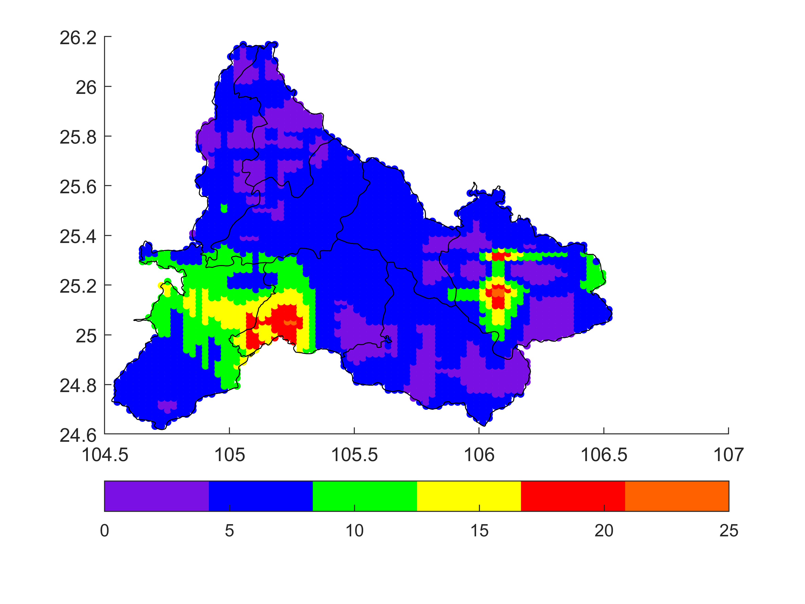

## 自动站降水插值

一种基于空间区域插值预测降雨量的方法

需求：一部分点为自动站观测到的降雨量，需要预测某个地区其他位置的降雨量

（版本：matlab2020a，低版本matlab查看中文注释会乱码，建议用记事本/notepad++打开查看注释）

- data.mat  数据文件，第一列为位置编号，第二三列为经纬度。第四列为降雨量
- Edge_Judge.m  判断地图边界
- ErrorAnalysis.m  误差分析（需要先运行main.m）
- IDW.m  反距离加权函数
- main.m 主程序
- 黔西南.shp 地图文件

